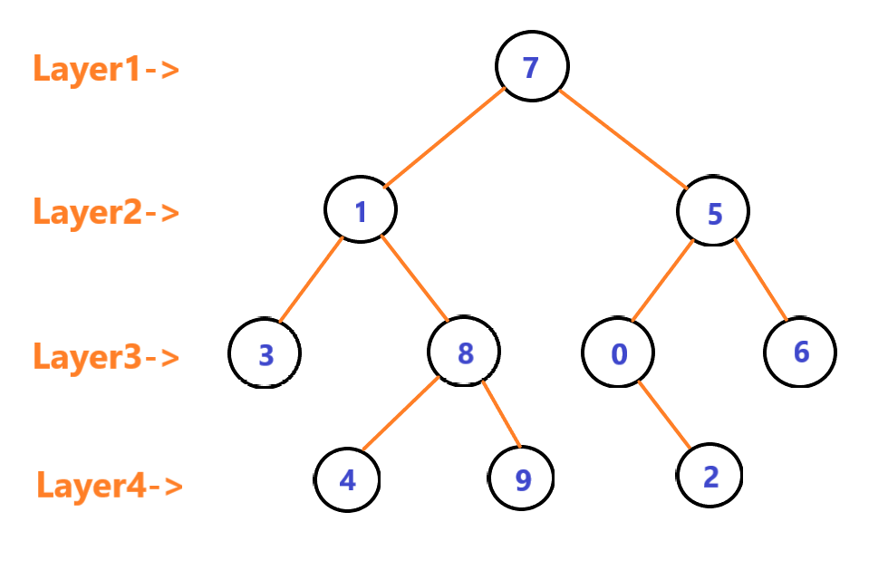

<h2>Proje</h2>
<strong>[7, 5, 1, 8, 3, 6, 0, 9, 4, 2] dizisinin Binary-Search-Tree aşamalarını yazınız.</strong>
<h2>Cevap</h2>

<b>1 -> </b>root <b>7</b>'dir. root'un sağında <b>5</b>, solunda <b>1</b> bulunur.

<b>2 -> </b>root <b>1</b>'dir. root'un sağında <b>8</b>, solunda <b>3</b> bulunur.

<b>3 -> </b>root <b>8</b>'dir. root'un sağında <b>9</b>, solunda <b>4</b> bulunur.

<b>4 -> </b>root <b>5</b>'dir. root'un sağında <b>6</b>, solunda <b>0</b> bulunur.

<b>5 -> </b>root <b>0</b>'dir. root'a bağlı sadece <b>2</b> vardır.

<h3>Layer'lar</h3>
<ol>
  <li>7</li>
  <li>1 - 5</li>
  <li>3 - 8 , 0 - 6</li>
  <li>4 - 9 , 2</li>
</ol>

