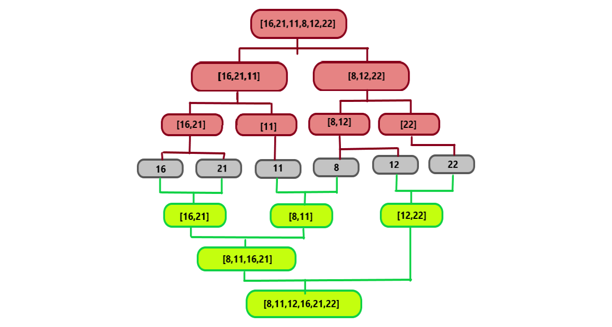

<h2>Proje</h2>

<strong>[16,21,11,8,12,22] -> Merge Sort</strong>

<ul>
  <li>Yukarıdaki dizinin sort türüne göre aşamalarını yazınız.</li>
  <li>Big-O gösterimini yazınız.</li>
</ul>
<h2>Cevap</h2>
<h4>Önce parçalama işlemini yapıyoruz!</h4>

<strong>1 -></strong> [16,21,11,8,12,22]

<strong>2 -></strong> [16,21,11] [8,12,22]

<strong>3 -></strong> [16,21] [11] [8,12] [22]

<strong>4 -></strong> [16] [21] [11] [8] [12] [22]

<h4>Şimdi de birleştiriyoruz!</h4>

<strong>5 -></strong> [16,21] [8,11] [12,22]

<strong>6 -></strong> [8,11,16,21] [12,22]

<strong>7 -></strong> [8,11,12,16,21,22]

Böylelikle <strong>7</strong> işlemde sıralamış olduk!

